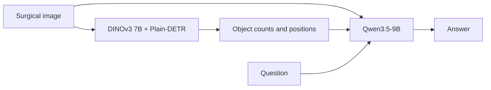

# SurgHint · FRAME

FRAME pairs a fine-tuned Plain-DETR head on frozen **DINOv3 7B (ViT-7B/16)** with **Qwen3.5-9B**, which answers questions from the surgical image and detector hints.

[Project overview](../README.md) · [Checkpoints](https://huggingface.co/OUAydin/ORena-SurgHint-solution/tree/main/FRAME-track/weights/custom) · [Training guide](TRAINING.md)



## Inference

**Requirements:** Linux, Conda, a CUDA 12.8-compatible driver and a BF16-capable NVIDIA GPU. The release targets **24 GB VRAM on one GPU**.

### 1. Install

```bash
git clone https://github.com/orhunutkuaydin/orena-surghint.git && cd orena-surghint/FRAME-track
conda create -n surghint-frame python=3.11 pip -y
conda activate surghint-frame
python -m pip install -e . --extra-index-url https://download.pytorch.org/whl/cu128
```

Run subsequent commands from `FRAME-track/`; FRAME and SEGMENT require separate environments.

### 2. Download the released checkpoints

Request access on [Hugging Face](https://huggingface.co/OUAydin/ORena-SurgHint-solution). After approval, log in and download:

```bash
hf auth login
hf download OUAydin/ORena-SurgHint-solution \
  --include "FRAME-track/weights/custom/*" \
  --local-dir ..
```

| Download | Local destination |
| --- | --- |
| [Plain-DETR head](https://huggingface.co/OUAydin/ORena-SurgHint-solution/blob/main/FRAME-track/weights/custom/plain-detr-head.pth) | `weights/custom/plain-detr-head.pth` |
| [Qwen3.5-9B LoRA adapter](https://huggingface.co/OUAydin/ORena-SurgHint-solution/tree/main/FRAME-track/weights/custom/qwen-lora) | `weights/custom/qwen-lora/` |

### 3. Obtain the frozen DINOv3 7B backbone

Download **DINOv3 7B (ViT-7B/16) pretrained on LVD-1689M** through [Meta's access form](https://ai.meta.com/resources/models-and-libraries/dinov3-downloads/), then copy the original checkpoint to the expected path:

```bash
mkdir -p weights/base/dinov3
cp /path/to/dinov3_vit7b16_pretrain_lvd1689m-a955f4ea.pth \
  weights/base/dinov3/dinov3_vit7b16_backbone.pth
```

### 4. Prepare and verify

```bash
python -m surghint.weights sources
python -m surghint.weights download-qwen
python -m surghint.weights qwen
python -m surghint.weights detector
python -m surghint.weights verify
```

Preparation downloads the pinned DINOv3 7B code and [Qwen3.5-9B base model](https://huggingface.co/Qwen/Qwen3.5-9B). The adapter is merged in FP32 on CPU and exported in BF16 to `weights/runtime/qwen/`; detector files go to `weights/runtime/detector/`. [Revisions and checksums](surghint/checksums.txt).

Downloaded checkpoints remain hash-validated. The local Qwen merge records its pinned inputs and output size in `weights/runtime/qwen/MERGE_INFO.json`; it has no fixed output checksum because byte-level FP32 results can vary across CPU implementations.

### 5. Ask a question

```bash
export CUDA_VISIBLE_DEVICES=0
surghint \
  --image frame.jpg \
  --question "How many foreign objects are visible?" \
  --output answer.txt
```

The detector and VLM run sequentially. Use `--weights-dir DIRECTORY` for a different checkpoint root.

For a small batch from prepared FRAME metadata, load the detector and VLM once each:

```bash
python -m surghint.batch_inference \
  --metadata /path/to/data/metadata/test.parquet \
  --data-root /path/to/data \
  --limit 10 \
  --output frame-test-10.csv
```

The output CSV retains the selected metadata columns and adds `prediction`. The original FRAME `test` split was included in release-model training, so this is a pipeline check rather than held-out evaluation.

## Release settings

| Component | Configuration |
| --- | --- |
| Detector input | 1024-pixel short side; aspect ratio preserved |
| Detector evidence | Confidence floor 0.05; Gaussian soft-NMS for counting questions |
| VLM input | 960 × 540 image, detector hint and question |
| Decoding | Greedy, thinking disabled; at most 128 new tokens |
| Prediction | One model answer; no voting or test-time augmentation |

The detector covers **Sponge, Clip, Specimen Bag, Silicone Loop, External Drain, Needle, Gallstone and Specimen**. The VLM prompt also defines Mesh and Absorbable Hemostatic Agent, which have no detector evidence.

## Training

See the [training guide](TRAINING.md). Detector annotations for **HeiCo** and **Surgical Gauze** are available in the [SurgHint annotation archive](https://zenodo.org/records/22769709). The remaining detector-training annotations have been provided to the challenge organizers and will be released with the **LapChole** dataset.

## Licence

[Source code](../README.md#licence) · [Checkpoint licences and access terms](https://huggingface.co/OUAydin/ORena-SurgHint-solution)
