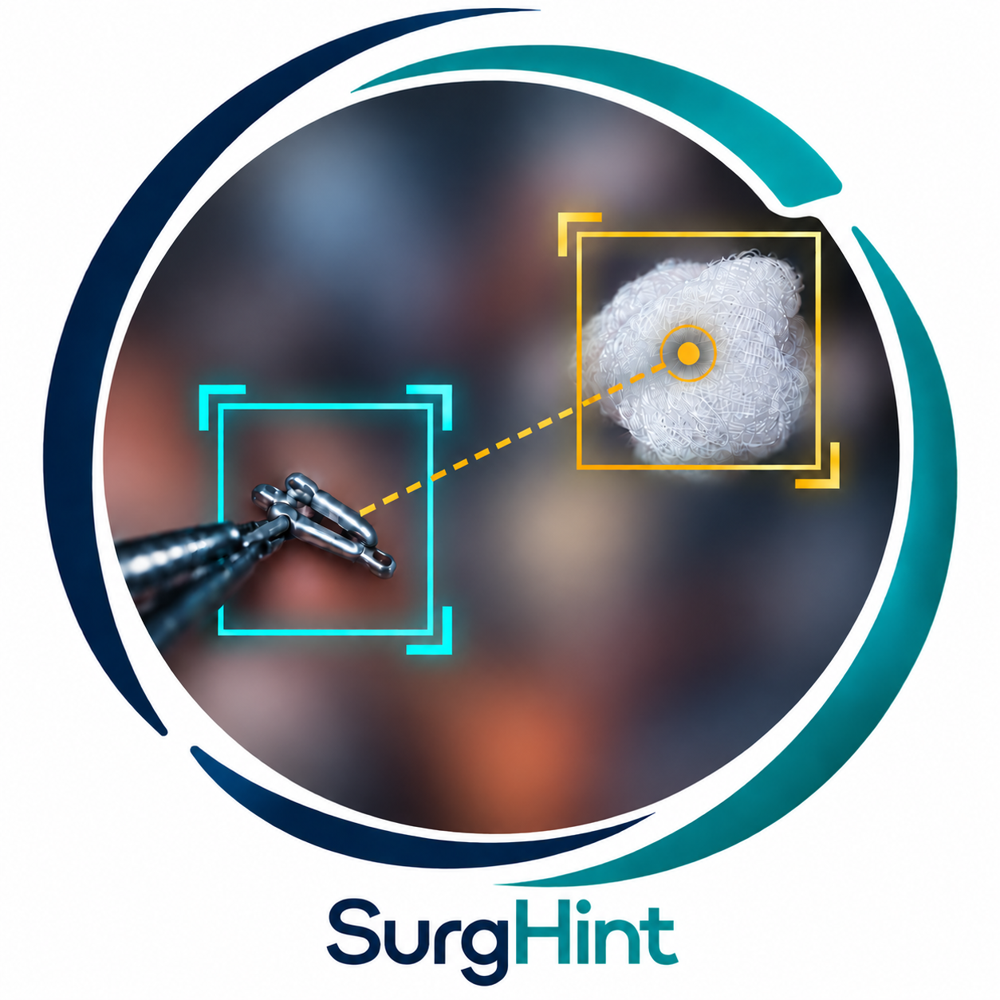

  

# SurgHint

SurgHint is a surgical visual question answering system for the [ORena FOCUS Challenge](https://orena-focus-challenge.org). It uses object detections to guide answers about foreign objects in single images (**FRAME**) and video clips (**SEGMENT**).

**Team VLM_MAXXING:** Orhun Utku Aydin, Frank te Nijenhuis and Dietmar Frey.

## Get started

| Track | Input | Method | Guides |
| --- | --- | --- | --- |
| **FRAME** | One surgical image and a question | **DINOv3 7B** + Plain-DETR detections provide text hints to Qwen3.5-9B | [Setup and inference](FRAME-track/README.md#inference) · [Training](FRAME-track/TRAINING.md) |
| **SEGMENT** | A surgical clip and a question | RF-DETR-L tracking provides 24 selected frames and text hints to Qwen3.6-27B | [Setup and inference](SEGMENT-track/README.md#inference) · [Training](SEGMENT-track/TRAINING.md) |

Our FRAME solution runs on one 24 GB GPU, for SEGMENT track we recommend one 80 GB GPU.

## Released checkpoints

Request access on [Hugging Face](https://huggingface.co/OUAydin/ORena-SurgHint-solution). 

| Track | Released weights |
| --- | --- |
| FRAME | [Plain-DETR detector head](https://huggingface.co/OUAydin/ORena-SurgHint-solution/blob/main/FRAME-track/weights/custom/plain-detr-head.pth), fine-tuned from Meta's COCO2017 checkpoint |
| FRAME | [Qwen3.5-9B LoRA adapter](https://huggingface.co/OUAydin/ORena-SurgHint-solution/tree/main/FRAME-track/weights/custom/qwen-lora) |
| SEGMENT | [Fine-tuned RF-DETR-L](https://huggingface.co/OUAydin/ORena-SurgHint-solution/blob/main/SEGMENT-track/weights/custom/rfdetr-large.pth) |
| SEGMENT | [Qwen3.6-27B LoRA adapter and support files](https://huggingface.co/OUAydin/ORena-SurgHint-solution/tree/main/SEGMENT-track/weights/custom/qwen-lora) |

Qwen base weights and FRAME's frozen **DINOv3 7B (ViT-7B/16)** backbone are obtained separately, as described in the track guides.

## Annotations

The [SurgHint annotation archive](https://zenodo.org/records/22769709) contains bounding-box labels and source-file mappings for selected **HeiCo** and **Surgical Gauze** frames. Images and videos are obtained separately from the original dataset sources.

## Licence

Project-authored source code is licensed under [Apache-2.0](LICENSE). Third-party code retains its original licences and notices. Model checkpoints have separate, component-specific licences documented on [Hugging Face](https://huggingface.co/OUAydin/ORena-SurgHint-solution).

These models are intended for research and reproducibility of our solution.

The SurgHint logo was generated with OpenAI's `gpt-image` v2.0.
