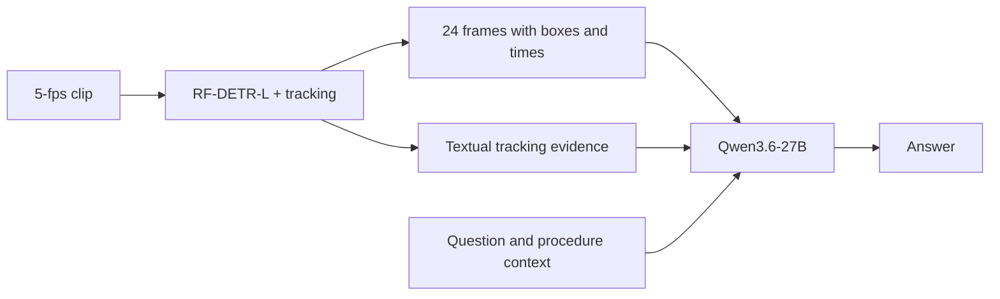

# SurgHint-Video · SEGMENT

Our solution uses realtime foreign object tracking (RF-DETR-L) and creates visual and text hints for surgical video clips. **Qwen3.6-27B** answers questions from 24 selected frames with boxes and timestamps, plus textual tracking evidence.

[Project overview](../README.md) · [Checkpoints](https://huggingface.co/OUAydin/ORena-SurgHint-solution/tree/main/SEGMENT-track/weights/custom) · [Training guide](TRAINING.md)



## Inference

**Requirements:** Linux, Python 3.11, a CUDA 12.8-compatible driver, one BF16-capable NVIDIA GPU and FFmpeg with libx264. **80 GB VRAM is recommended** for the unquantized 27B model.

### 1. Install

```bash
git clone https://github.com/orhunutkuaydin/orena-surghint.git && cd orena-surghint/SEGMENT-track
conda create -n surghint-segment -c conda-forge python=3.11 ffmpeg pip -y
conda activate surghint-segment
python -m pip install -e . --extra-index-url https://download.pytorch.org/whl/cu128
```

Run subsequent commands from `SEGMENT-track/`

### 2. Download the released checkpoints

Request access on [Hugging Face](https://huggingface.co/OUAydin/ORena-SurgHint-solution). After approval, log in and download:

```bash
hf auth login
hf download OUAydin/ORena-SurgHint-solution \
  --include "SEGMENT-track/weights/custom/*" \
  --local-dir ..
```

| Download | Local destination |
| --- | --- |
| [RF-DETR-L checkpoint](https://huggingface.co/OUAydin/ORena-SurgHint-solution/blob/main/SEGMENT-track/weights/custom/rfdetr-large.pth) | `weights/custom/rfdetr-large.pth` |
| [Qwen3.6-27B LoRA adapter and support files](https://huggingface.co/OUAydin/ORena-SurgHint-solution/tree/main/SEGMENT-track/weights/custom/qwen-lora) | `weights/custom/qwen-lora/` |

**Keep all adapter support files**, including the processor, tokenizer and chat template.

<details>
<summary>Required files for a manual download</summary>

```text
weights/custom/
├── rfdetr-large.pth
└── qwen-lora/
    ├── adapter_config.json
    ├── adapter_model.safetensors
    ├── config.json
    ├── generation_config.json
    ├── processor_config.json
    ├── tokenizer_config.json
    ├── tokenizer.json
    └── chat_template.jinja
```

Retain the licence and notice files alongside these files.

</details>

### 3. Prepare and verify

```bash
python -m surghint.weights prepare
python -m surghint.weights verify
```

Preparation downloads the pinned [Qwen3.6-27B base model](https://huggingface.co/Qwen/Qwen3.6-27B), merges the adapter on CPU and verifies the result in `weights/runtime/qwen/`. [Revisions and checksums](surghint/checksums.txt).

### 4. Prepare a clip and ask a question

Input must be a **pre-trimmed clip without burned-in overlays, at 4.8–5.2 fps**. This example extracts procedure seconds 205–244:

```bash
ffmpeg -ss 205 -i procedure.mp4 -t 39 \
  -an -vf fps=5 -c:v libx264 -crf 18 -pix_fmt yuv420p clip.mp4

export CUDA_VISIBLE_DEVICES=0
surghint \
  --video clip.mp4 \
  --question "Which foreign object classes are visible?" \
  --procedure "Sigmoid Resection" \
  --start-time 205 \
  --end-time 244 \
  --output answer.txt
```

**`--start-time` and `--end-time` are absolute procedure times in seconds**; their difference must match the clip duration.

Use `--weights-dir DIRECTORY` for a different checkpoint root.

## Release settings

| Component | Configuration |
| --- | --- |
| Detector | RF-DETR-L at 896 × 896; FP16, batches of 32 |
| Detection filtering | Confidence 0.5; class-wise NMS 0.5 |
| Tracking | Per-class C-BIoU; reset for every question clip |
| VLM input | 24 images at 768 × 448; boxes, absolute timestamps and tracking hint |
| VLM inference | BF16; native PyTorch attention; thinking disabled |
| Decoding | Greedy; at most 256 new tokens |

Decoding sets `do_sample=False`, overriding the sampling defaults in `generation_config.json`.

The detector covers **Sponge, Clip, Specimen Bag, Silicone Loop, External Drain, Needle, Gallstone and Specimen**. The VLM prompt also defines Mesh and Absorbable Hemostatic Agent, which have no detector evidence.

## Training

Load a custom exported VLM with `--model-dir`; see [training and export](TRAINING.md#export-and-use-a-trained-vlm). Detector annotations for **HeiCo** and **Surgical Gauze** are available in the [SurgHint annotation archive](https://zenodo.org/records/22769709). The remaining detector-training annotations have been provided to the challenge organizers and will be released with the **LapChole** dataset.

## Licence

[Source code](../README.md#licence) · [Checkpoint licences and access terms](https://huggingface.co/OUAydin/ORena-SurgHint-solution)
